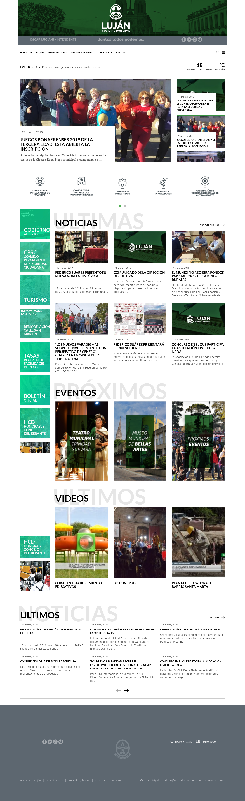
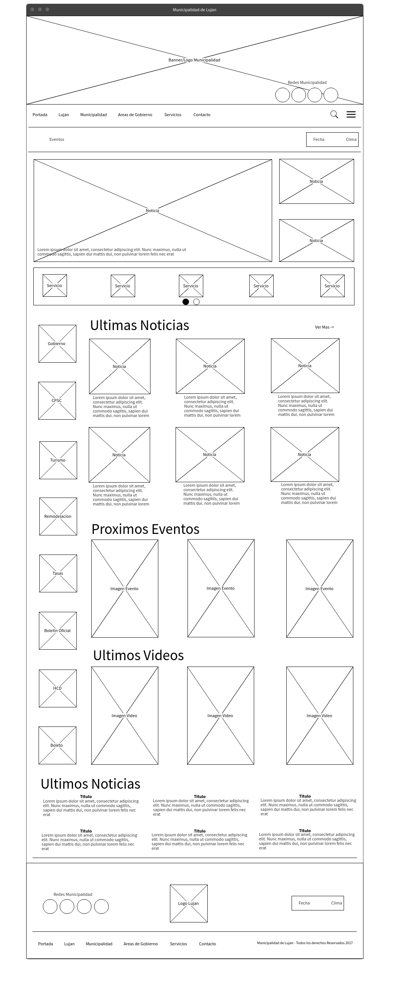

# TP1-HTML  
5.Dibujar el Wireframe correspondiente a la página principal de lujan.gob.ar y en función a este
desarrollar el código HTML5 correspondiente. Nota: Realizar una captura en imagen del sitio a
fin de poder corregir contrastando con lo que muestra el sitio ese día ya que puede variar.  
  
Captura del Sitio:  
  
  
  
Wireframe:  
  

