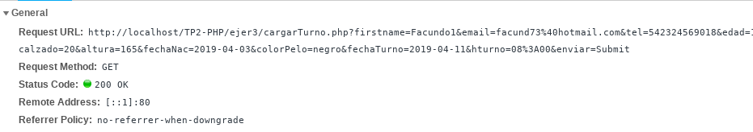
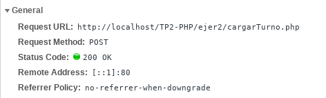

# TP2-PHP  
~~~
3. Realice las modificaciones necesarias para que el script del punto anterior reciba los datos mediante
el método GET. ¿Qué diferencia nota? ¿Cuándo es conveniente usar cada método? Consejo: Utilice las
herramientas de desarrollador de su Navegador (Pestaña Red) para observar las diferencias entre las
diferentes peticiones.
~~~  
##  Respuestas:  
  Para utilizar el metodo GET, solo se debe cambiar el atributo "method" del tag form, ya que en cargarTurno.php se detecta el metodo utilizado. La diferencia es que los datos enviados por el usuario se anexan a la URL, en forma de pares (dato=valor) y cada dato separado por '&'. Cuando se utilizo metodo POST los datos se incluyeron en el cuerpo del mensaje.  
  Para enviar datos sensibles no se recomienda utilizar GET, ya que se mostrarian los datos en la barra de direcciones, si se  requieren enviar gran cantidad de datos tampoco es recomendable ya que los navegadores limitan el tamaño de las URL,  resulta util cuando se envian datos que no requieren seguridad como algun tipo de query.  

Header Get:
    

Header Post:  
    
  
  Ejecutar formulario.html
